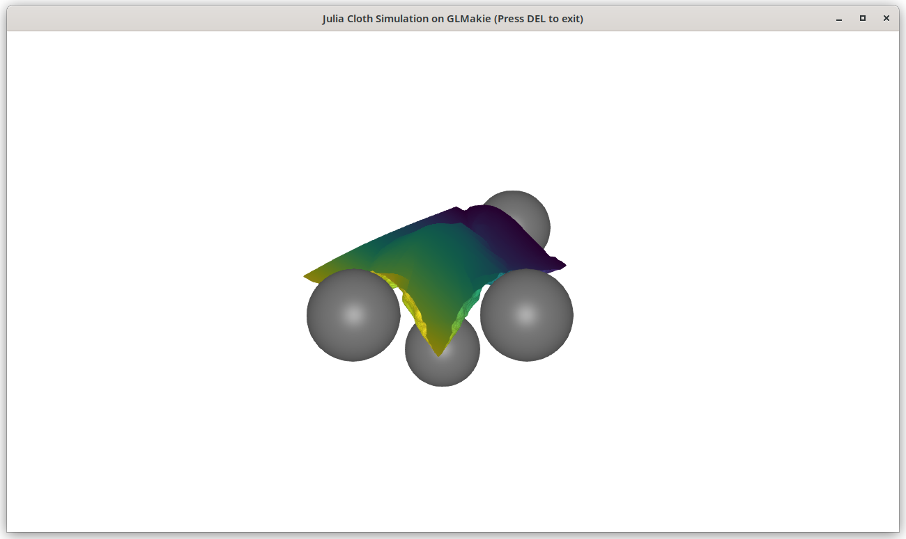
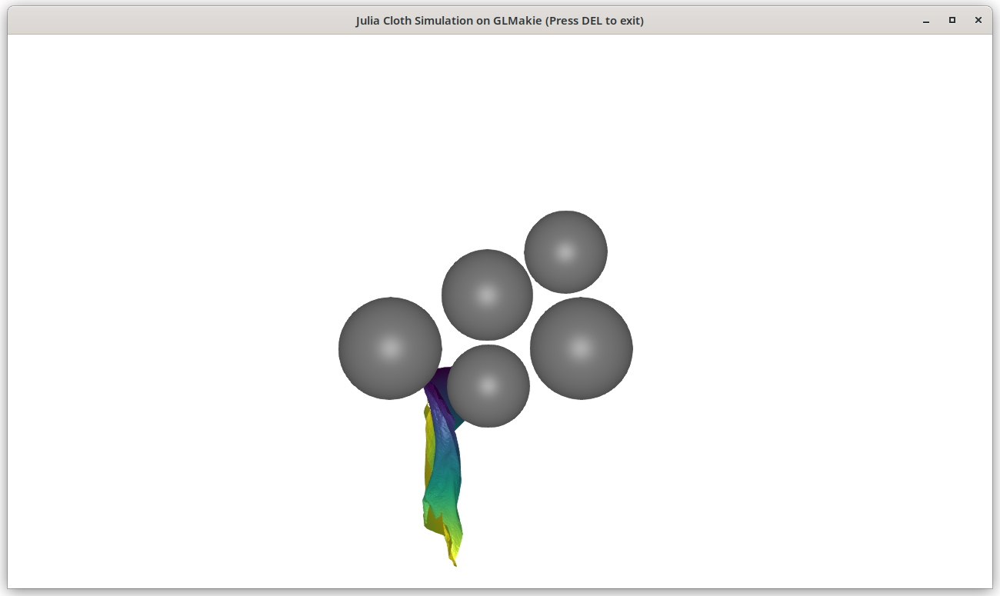

# Julia Cloth Simulation

This is a Julia port of [Taichi Cloth Simulation](https://github.com/taichi-dev/cloth-simulation-homework).

- Due to Julia's notorious TTFP (Time to first plot) issue, if you want to run the code as a script, it is recommended that a sysimage be built with `create_sysimage.jl`.
- Currently, the implementation works but runs very slow.

